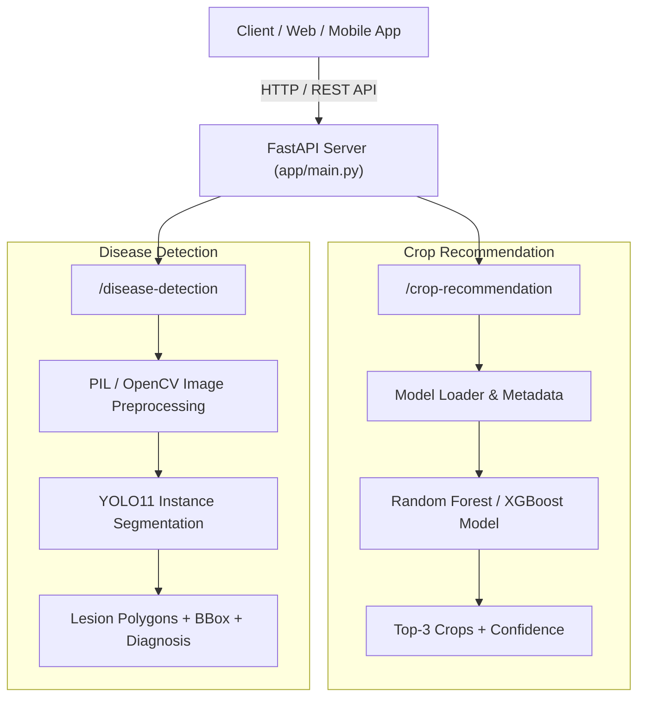

# 🌿 AlexxaFarms AI Service — Crop Recommendation & Disease Detection

[](https://www.python.org/)
[](https://fastapi.tiangolo.com/)
[](https://github.com/ultralytics/ultralytics)
[](https://scikit-learn.org/)
[](http://127.0.0.1:8000/docs)

The **AI Layer** for the AlexxaFarms smart agriculture and polyhouse platform. This service delivers real-time machine learning predictions for **Crop Recommendation** (based on soil and environmental parameters) and computer vision **Plant Disease Detection & Segmentation** (using state-of-the-art YOLOv11 instance segmentation).

---

## 📌 Table of Contents
- [🌟 Key Features](#-key-features)
- [🏗 System Architecture](#-system-architecture)
- [📂 Project Structure](#-project-structure)
- [🚀 Quickstart & Setup](#-quickstart--setup)
- [📡 API Documentation & Endpoints](#-api-documentation--endpoints)
  - [1. System Health](#1-system-health)
  - [2. Crop Recommendation](#2-crop-recommendation)
  - [3. Disease Detection](#3-disease-detection)
- [🖥 Local Web Demo](#-local-web-demo)
- [📦 GitHub & Version Control Guide](#-github--version-control-guide)
- [🛠 Tech Stack](#-tech-stack)

---

## 🌟 Key Features

### 1. 🌾 Crop Recommendation Engine
- **Multi-Factor Input**: Analyzes Nitrogen ($N$), Phosphorus ($P$), Potassium ($K$), Soil pH, Temperature (°C), and Humidity (%).
- **Top-3 Ranked Recommendations**: Returns the most optimal crops alongside confidence probabilities.
- **Category Filtering**: Filter predictions specifically by category (e.g., `vegetable`, `fruit`, `cereal`, `legume`).
- **Rich Metadata**: Includes crop descriptions, growth period, water requirements, and season insights.

### 2. 🍃 Plant Disease Detection & Segmentation
- **YOLOv11 Instance Segmentation**: Precise lesion boundary delineation using polygonal masks rather than simple bounding boxes.
- **Multi-Crop Coverage (20 Classes)**:
  - **Tomato**: Bacterial Leaf Spot, Early Blight, Late Blight, Leaf Mold, Mosaic Virus, Septoria Leaf Spot, Yellow Leaf Curl
  - **Cucumber**: Angular Leaf Spot, Bacterial Wilt, Powdery Mildew
  - **Grape**: Black Rot, Downy Mildew, Leaf Spot, Leafroll Disease
  - **Chilli**: Leaf Spot, Anthracnose
  - **Zucchini**: Powdery Mildew
  - **Squash**: Powdery Mildew
  - **Turmeric**: Blotch, Leaf Spot
- **Healthy vs. Diseased Detection**: Correctly identifies healthy leaves without false alarms.
- **High Performance**: Sub-second GPU/CPU inference with detailed polygon and bounding box coordinates for frontend visualization.

---

## 🏗 System Architecture



---

## 📂 Project Structure

```text
AI_Service/
├── app/
│   ├── __init__.py
│   └── main.py                      # FastAPI root application & CORS setup
│
├── crop_recommendation/
│   ├── config/                      # Category definitions and configurations
│   ├── inference/                   # Model loader and prediction service
│   ├── models/                      # Model weights (.pkl / .joblib - gitignored)
│   ├── crop_metadata.json           # Nutritional and agronomic crop metadata
│   ├── requirements.txt             # Crop module specific dependencies
│   ├── router.py                    # API routes (/crop-recommendation)
│   ├── schemas.py                   # Pydantic request and response schemas
│   └── scripts/                     # Model training and data exploration scripts
│
├── disease_detection/
│   ├── models/                      # Pretrained & trained YOLO weights (.pt - gitignored)
│   ├── services/                    # YOLO detector and inference wrappers
│   ├── segmentation_pipeline/       # Dataset prep, augmentation & training pipelines
│   ├── scripts/                     # Dataset conversion and analysis utilities
│   ├── CHANGELOG_V2.md              # Dataset & model version history
│   └── router.py                    # API routes (/disease-detection)
│
├── frontend/                        # Standalone interactive UI demo
│   ├── index.html                   # Interactive web dashboard
│   ├── style.css                    # Modern UI styling
│   └── app.js                       # Frontend logic connecting to FastAPI backend
│
├── .gitignore                       # Clean repository exclusions (datasets, heavy weights)
├── data.yaml                        # Dataset class mapping configuration
├── requirements.txt                 # Unified project dependencies
└── README.md                        # Documentation
```

---

## 🚀 Quickstart & Setup

### 1. Prerequisites
- Python **3.10** or higher
- `pip` and `virtualenv`
- *(Optional)* NVIDIA GPU with CUDA support for accelerated YOLO inference

### 2. Clone and Setup Environment

```bash
# Clone the repository
git clone https://github.com/YourUsername/AI_Service.git
cd AI_Service

# Create a virtual environment
python -m venv .venv

# Activate the virtual environment
# Windows (PowerShell):
.venv\Scripts\Activate.ps1
# Linux / macOS:
source .venv/bin/activate
```

### 3. Install Dependencies

```bash
pip install --upgrade pip
pip install -r requirements.txt
```

### 4. Model Weights Placement & Downloads
Because binary model files are excluded from Git, download the trained models from the links below and place them in their respective directories:

| Model / Asset | Target Destination Path | Download Link |
| :--- | :--- | :--- |
| **Label Encoder** | `crop_recommendation/models/random_forest/label_encoder_v7.1.pkl` | [Download from Google Drive](https://drive.google.com/file/d/1uFcuDG5dLsIGV5jzud6PsW23bumS7UOW/view?usp=sharing) |
| **Random Forest Crop Model** | `crop_recommendation/models/random_forest/rf_crop_model_v7.1.pkl` | [Download from Google Drive](https://drive.google.com/file/d/10zAb8bSOT_z05A7jvEChqexTl2iK6RHw/view?usp=sharing) |
| **Disease Detection Model** | `disease_detection/models/trained/best_v6.pt` | [Download from Google Drive](https://drive.google.com/file/d/1n39dus-hOZwfYA-izXHCmz7Tsj9f_4aH/view?usp=sharing) |

### 5. Launch the API Server

```bash
uvicorn app.main:app --reload --host 0.0.0.0 --port 8000
```

- API Base URL: `http://127.0.0.1:8000`
- Interactive Swagger Documentation: `http://127.0.0.1:8000/docs`
- Redoc Documentation: `http://127.0.0.1:8000/redoc`

---

## 📡 API Documentation & Endpoints

### 1. System Health

#### `GET /health`
Returns the operational status of the AI service.

**Response:**
```json
{
  "status": "healthy",
  "service": "AlexxaFarms AI Service",
  "version": "2.0.0"
}
```

---

### 2. Crop Recommendation

#### `POST /crop-recommendation/predict`
Predicts the top-3 suitable crops based on soil nutrients and climate conditions.

**Request Body (`application/json`):**
```json
{
  "nitrogen": 85.0,
  "phosphorus": 45.0,
  "potassium": 40.0,
  "temperature": 26.5,
  "humidity": 78.0,
  "ph": 6.5,
  "category": "vegetable"
}
```
*(Note: `category` is optional)*

**Response (`200 OK`):**
```json
{
  "recommendations": [
    {
      "crop": "Tomato",
      "category": "vegetable",
      "confidence": 92.45
    },
    {
      "crop": "Cucumber",
      "category": "vegetable",
      "confidence": 5.12
    },
    {
      "crop": "Chilli",
      "category": "vegetable",
      "confidence": 2.43
    }
  ]
}
```

---

### 3. Disease Detection

#### `POST /disease-detection/detect`
Upload an image of a crop leaf to detect and segment disease lesions.

**Request (`multipart/form-data`):**
- `file`: Leaf image file (`.jpg`, `.jpeg`, `.png`)

**Response — Diseased Leaf (`200 OK`):**
```json
{
  "success": true,
  "filename": "tomato_leaf.jpg",
  "model": "YOLO11 Segmentation",
  "crop": "Tomato",
  "status": "diseased",
  "diagnosis": "Tomato - Early Blight",
  "confidence": 0.9421,
  "inference_time_ms": 42.5,
  "image": {
    "width": 1024,
    "height": 768
  },
  "total_detections": 1,
  "detections": [
    {
      "class_id": 1,
      "crop": "Tomato",
      "disease": "Early Blight",
      "confidence": 0.9421,
      "bbox": {
        "x1": 215.4,
        "y1": 130.2,
        "x2": 450.8,
        "y2": 390.6
      },
      "polygon": [
        {"x": 215.4, "y": 130.2},
        {"x": 230.1, "y": 125.0},
        {"x": 310.5, "y": 140.2}
      ]
    }
  ]
}
```

**Response — Healthy Leaf (`200 OK`):**
```json
{
  "success": true,
  "filename": "healthy_leaf.jpg",
  "model": "YOLO11 Segmentation",
  "status": "healthy",
  "diagnosis": "Healthy",
  "message": "No disease symptoms detected.",
  "total_detections": 0,
  "detections": []
}
```

---

## 🖥 Local Web Demo

A lightweight dashboard is available in `frontend/` to test both endpoints interactively with visual mask overlays:

1. Ensure the backend server is running on `http://127.0.0.1:8000`.
2. Open `frontend/index.html` in any modern web browser or serve it using a local server:
   ```bash
   # Using Python's built-in HTTP server
   cd frontend
   python -m http.server 3000
   ```
3. Visit `http://localhost:3000` to interact with the UI.

---

## 📦 GitHub & Version Control Guide

### What to Push to GitHub ✅
- **Application source code**: `app/`, `crop_recommendation/`, `disease_detection/`, `frontend/`
- **Configuration files**: `data.yaml`, `crop_metadata.json`, `crop_categories.py`
- **Pipeline & utility scripts**: `disease_detection/scripts/`, `crop_recommendation/scripts/`
- **Dependencies & documentation**: `requirements.txt`, `README.md`, `CHANGELOG_V2.md`, `.gitignore`

### What is Excluded via `.gitignore` ❌
- **Heavy ML model weights**: `*.pt`, `*.pth`, `*.pkl`, `*.joblib`, `*.onnx` (Host via GitHub Releases, Google Drive, or Hugging Face)
- **Raw datasets & image batches**: `datasets/`, `plantseg_*/`, `turmeric_*/`, `healthy_dataset_*/`
- **Virtual environments & caches**: `.venv/`, `__pycache__/`, `.pytest_cache/`, `*.log`
- **Generated visual dumps & logs**: `runs/`, `generated_masks/`, `overlay_visualizations/`

---

## 🛠 Tech Stack

- **Framework**: [FastAPI](https://fastapi.tiangolo.com/), [Uvicorn](https://www.uvicorn.org/)
- **Computer Vision**: [Ultralytics YOLOv11](https://github.com/ultralytics/ultralytics), [OpenCV](https://opencv.org/), [Pillow](https://pillow.readthedocs.io/)
- **Machine Learning**: [Scikit-Learn](https://scikit-learn.org/), [XGBoost](https://xgboost.readthedocs.io/), [Pandas](https://pandas.pydata.org/), [NumPy](https://numpy.org/)
- **Data Validation & Schemas**: [Pydantic](https://docs.pydantic.dev/)
- **Frontend**: HTML5, CSS3 (Modern Glassmorphism & Custom Properties), Vanilla JavaScript
